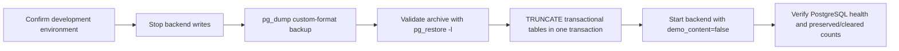

# Development Data Reset — 2026-07-17

**Environment:** Local development PostgreSQL 16
**Purpose:** Prepare a clean acceptance baseline while preserving identity and reference data
**Outcome:** Completed and verified

## Safety flow

This is an operational maintenance flow; no product use-case or actor authorization sequence changed.

## Backup evidence

- Local archive: `backups/mtexam-before-acceptance-reset-20260717-111441.dump`
- Format: PostgreSQL custom archive, gzip compressed
- Size: 159,872 bytes
- Archive validation: `pg_restore -l` succeeded with 200 TOC entries
- The archive is intentionally ignored by Git because it contains local database data.

Restore rehearsal must use a separate database. Never restore over an active environment without an
approved outage and a second backup.

## Preserved data

| Table group | Verified count after restart |
|---|---:|
| User accounts | 8 |
| Persons | 8 |
| Employee compatibility rows | 10 |
| Person-unit assignments | 6 |
| Subjects | 2 |
| Organization units | 179 |

The idempotent master seed added one missing account scope assignment during restart; it did not
create a new person, user, subject or organization.

## Cleared data

- Authentication sessions and login attempts
- Personnel import batches and staging rows
- Audit events (retained in the pre-reset archive)
- Practice sessions
- Question banks, questions, choices, tags and question versions
- Exam Creations, organization quota templates and selected questions
- Variants and variant-question snapshots
- Exam Windows and Window quota scopes
- Exam sessions and answers

Post-restart verification confirmed zero Question Banks, Questions, Exam Creations, Exam Windows,
Exam Sessions, Audit Logs and Auth Sessions. Backend health reported `database=postgresql`; frontend
and backend both returned HTTP 200.

## Configuration control

The committed default is `development_seed.master_data=true` and
`development_seed.demo_content=false`. Re-enabling demo content is an explicit temporary action and
must not be used in production. Automated evidence is in
`tests/api/test_development_seed_policy.py` and `tests/unit/test_config.py`.
