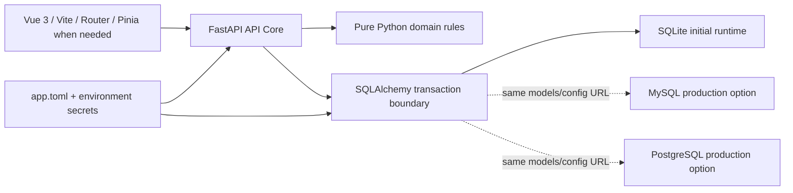

# MTExam Technology Proof of Concept

- **Ticket:** [POC-001 — Prove project technology stack](https://github.com/idev006/MTExam/issues/11)
- **Owner:** Technical Lead / Developer
- **Status:** Executable POC passed; external environment proofs remain tracked
- **Last executed:** 2026-07-15

## Objective

พิสูจน์ว่าเทคนิคและ technology stack ที่กำหนดไว้สามารถทำงานร่วมกันได้จริง โดยใช้โค้ดที่
อ่านง่าย ทดสอบซ้ำได้ และนำไปต่อยอดใน production implementation ได้ ไม่สร้าง demo stack แยก
และไม่เพิ่ม Redis, message broker, container orchestration หรือ service อื่นที่ยังไม่จำเป็น

POC นี้พิสูจน์ architecture และ critical domain invariants แต่ยังไม่ใช่ application feature ที่พร้อม
ใช้งานจริง เช่น CSV upload/apply API, login UI, question CRUD หรือ exam screen

## Architecture Under Test



Persistent state อยู่ใน database; ไม่มี Redis requirement. Frontend ไม่เป็น authority ของ permission,
เวลา หรือคะแนน และสามารถเปลี่ยน UI ได้โดยรักษา API contract เดิม

## Executable Coverage

| POC ID | Technique / technology | Executable proof | Result |
|---|---|---|---|
| POC-ENV-01 | Project virtual environment and pinned Python libraries | runner บังคับใช้ `.venv\\Scripts\\python.exe`; imports และ tests ใช้ `requirements.txt` | Passed |
| POC-CFG-01 | Typed TOML SSOT + environment override | โหลด `config/app.toml` ผ่าน Pydantic, override `DATABASE_URL`, ตรวจ secret ไม่ออก public API | Passed |
| POC-API-01 | FastAPI as System Core | health, generated OpenAPI, standard error, correlation ID และ CORS preflight | Passed |
| POC-DEP-01 | Minimal multi-tier deployment | FastAPI serve Vite `dist` ได้ใน process เดียว | Passed |
| POC-DB-01 | SQLAlchemy + SQLite | Thai Unicode, leading-zero phone, constraints และ system timestamps | Passed |
| POC-TXN-01 | Transaction integrity | force failure หลัง flush แล้วตรวจว่า employee ทั้งรายการ rollback | Passed |
| POC-MIG-01 | Alembic migration | SQLite upgrade → downgrade → upgrade → drift check บน temporary database | Passed |
| POC-PORT-01 | Database switch by URL | สร้าง engine สำหรับ SQLite/MySQL/PostgreSQL จาก config โดยไม่แก้ application code | Passed offline |
| POC-PORT-02 | Portable schema | compile ตารางทั้ง 24 ตารางด้วย SQLite, MySQL และ PostgreSQL dialect | Passed offline |
| POC-CSV-01 | CSV UTF-8/BOM and TOML header mapping | parse ภาษาไทย, BOM, optional column และรักษาเลขศูนย์นำหน้า | Passed |
| POC-CSV-02 | CSV deterministic validation | required/header/CID/rank/duplicate row errors มี row, field และ code | Passed |
| POC-REC-01 | Full-snapshot reconciliation | added, unchanged, changed, moved, missing และ reactivate | Passed |
| POC-AUTH-01 | Local credential primitives | Argon2id hash/verify และ deny password ผิด | Passed |
| POC-AUTH-02 | Future stateless token adapter | HS256 JWT, required claims, issuer/audience, expiry, signature และ secret ≥ 32 bytes | Passed as future adapter |
| POC-AUTH-03 | Database-backed browser sessions | token hash, role limits, oldest-session revoke, idle expiry และ logout revoke | Passed |
| POC-AUTHZ-01 | Role + organization scope | Super/Division/Bureau/Station admin allow descendant และ deny cross-scope | Passed |
| POC-VAR-01 | Reproducible variants | injected seed และ stable choice IDs ให้ order เดิมเมื่อ seed เดิม | Passed |
| POC-TIME-01 | Server-authoritative timer | individual/fixed batch, late entry, remaining seconds และ exact `ends_at` boundary | Passed |
| POC-SCORE-01 | Correct Decimal scoring | correct/wrong/unanswered, decimal weights, idempotency และไม่ขึ้นกับ display order | Passed |
| POC-AUDIT-01 | Trace correlation | API error/health มี correlation ID และ audit schema compile ทุก supported dialect | Passed at foundation level |
| POC-FE-01 | Vue 3 Composition API + Router + Pinia | existing app registration ผ่าน Vue type-check และ Vite production build | Passed |
| POC-FE-02 | Tailwind CSS + daisyUI | Vite build transform stylesheet และ daisyUI plugin สำเร็จ | Passed |
| POC-QA-01 | Test-friendly architecture | pure domain modules, pytest marker, Ruff, layer boundary และ source ≤ 800 lines | Passed |
| POC-CI-01 | CI-compatible verification | full pytest suite และ GitHub Actions gates ใช้ commandsเดียวกัน | [Run 29413533674](https://github.com/idev006/MTExam/actions/runs/29413533674) passed |

`Pinia` ถูก register แล้วแต่ยังไม่สร้าง global store ตัวอย่างที่ไม่มี use case จริง เมื่อเริ่ม auth/session
จึงค่อยสร้าง store เท่าที่จำเป็น ส่วน page/form state ให้เป็น local state ตามหลัก minimal stack
Browser auth ใช้ DB-backed session ตาม [ADR-0007](../adr/0007-database-backed-browser-sessions.md); JWT
POC เป็น adapter proof สำหรับ future consumer เท่านั้น

## Evidence

รันคำสั่งเดียวจาก project root:

```powershell
.\poc\run-poc.ps1
```

ผลล่าสุด:

| Gate | Evidence |
|---|---|
| Ruff | Passed |
| Executable POC | 34 passed |
| Existing backend/API/architecture tests | 18 passed |
| Backend total | 54 passed (34 POC + 20 existing) |
| Vue TypeScript | Passed |
| Vite production build | Passed; 40 modules transformed |
| Largest new source file | 287 lines; below 800-line rule |
| GitHub Actions | [Run 29413533674](https://github.com/idev006/MTExam/actions/runs/29413533674) passed at `a3e2cc2` |

Test source:

- `tests/poc/test_platform_poc.py`
- `tests/poc/test_employee_import_poc.py`
- `tests/poc/test_security_poc.py`
- `tests/poc/test_exam_rules_poc.py`

Reusable domain source:

- `backend/app/domain/employee_import.py`
- `backend/app/domain/security.py`
- `backend/app/domain/exam_rules.py`

## What Is Not Yet Proven

| Gap | Why this POC cannot close it | Tracking / release gate |
|---|---|---|
| Live MySQL and PostgreSQL migrations/transactions | ยังไม่มี connected database services; dialect compile ไม่เท่ากับ live execution | DATA-001 / DB-VERIFY-001 before production DB selection |
| Representative personnel CSV | ชุดค่าจริงของ gender/status และ organization reference ยังไม่ได้รับ | [PER-IMP-001](https://github.com/idev006/MTExam/issues/9) |
| Real SSO/OIDC | Provider และ metadata ยังไม่ถูกเลือก | [SEC-001](https://github.com/idev006/MTExam/issues/10) |
| 500-user workload | ต้องกำหนด workload, hosting และ production database ก่อน | M5 performance gate; risks R-003/R-011 |
| Cheap/free hosting behavior | ต้องเลือก host แล้วทดสอบ cold start, persistent disk และ resource limit | M4/M5 operations gate; risk R-008 |
| Backup/restore and disaster recovery | ต้องทราบ production database/retention policy | M4/M5 restore drill |
| Full browser E2E/accessibility/security review | Product screens และ auth flow ยังไม่ implement | M5 hardening gate |

รายการเหล่านี้เป็น deferred verification ไม่ใช่ผลผ่าน และห้ามใช้ผล offline POC เป็นเหตุอ้างว่า
production-ready

## Decisions Confirmed by the POC

- Modular Monolith + API Core เพียงพอสำหรับ initial release และเปลี่ยน UI ได้
- SQLite เหมาะกับ development/POC; การรองรับ workload production ต้องผ่าน database/load gate
- SQLAlchemy/Alembic และ config URL ทำให้เปลี่ยน driver ได้โดยไม่ผูก business rules กับ dialect
- CSV reconciliation, authorization, timing และ scoring ควรเป็น pure domain functions เพื่อ pytest ง่าย
- Argon2id + PyJWT เพียงพอเป็น local-auth primitive แต่ไม่ปิด SSO decision
- Frontend stackปัจจุบันครบโดยไม่ต้องเพิ่ม state/data-fetching library หรือ infrastructure service

## Exit Criteria

- POC tests, existing tests, Ruff, Vue type-check และ Vite build ผ่าน
- ผลและ limitation ถูกบันทึกในเอกสาร/Project tracking
- GitHub Project item ย้ายจาก In progress ไป Verify
- GitHub Actions ของ implementation commit ผ่าน; ticket รอ human review ก่อน Done
