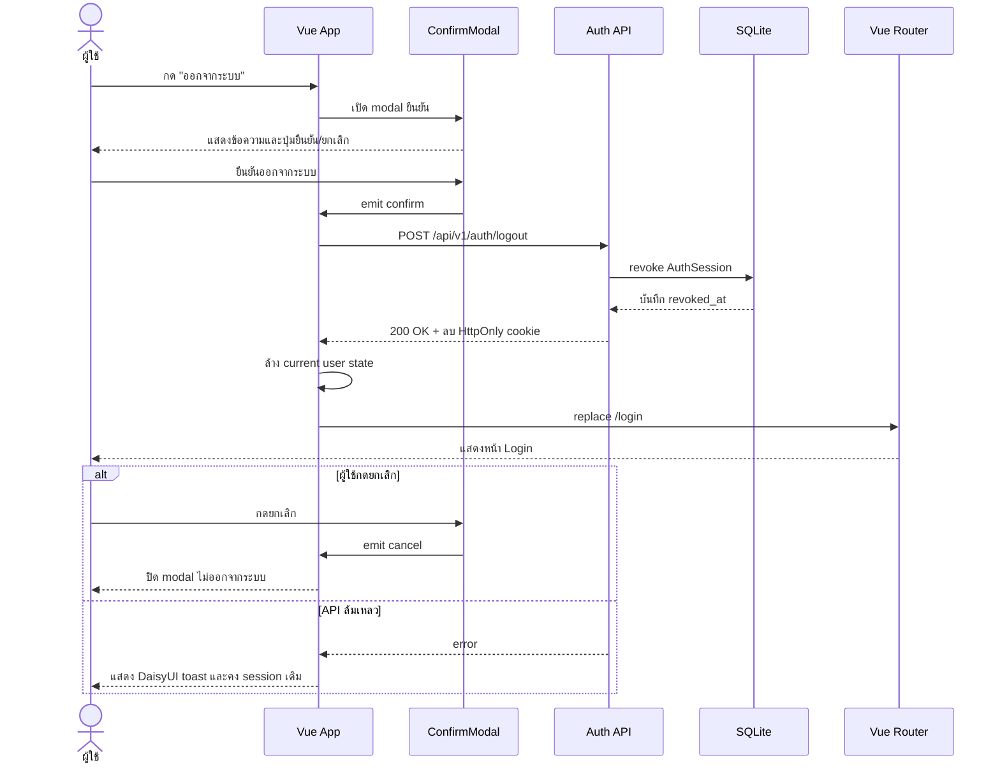

# Logout Sequence

```mermaid
sequenceDiagram
    actor U as ผู้ใช้
    participant UI as Vue App
    participant M as ConfirmModal
    participant API as Auth API
    participant DB as SQLite
    participant R as Vue Router

    U->>UI: กด "ออกจากระบบ"
    UI->>M: เปิด modal ยืนยัน
    M-->>U: แสดงข้อความและปุ่มยืนยัน/ยกเลิก
    U->>M: ยืนยันออกจากระบบ
    M->>UI: emit confirm
    UI->>API: POST /api/v1/auth/logout
    API->>DB: revoke AuthSession
    DB-->>API: บันทึก revoked_at
    API-->>UI: 200 OK + ลบ HttpOnly cookie
    UI->>UI: ล้าง current user state
    UI->>R: replace /login
    R-->>U: แสดงหน้า Login

    alt ผู้ใช้กดยกเลิก
        U->>M: กดยกเลิก
        M->>UI: emit cancel
        UI-->>U: ปิด modal ไม่ออกจากระบบ
    else API ล้มเหลว
        API-->>UI: error
        UI-->>U: แสดง DaisyUI toast และคง session เดิม
    end
```
