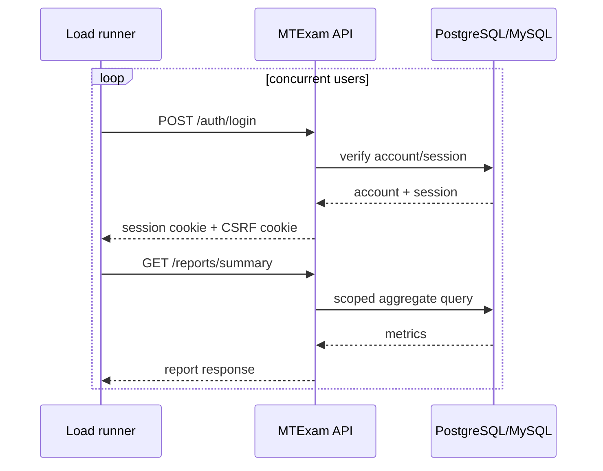
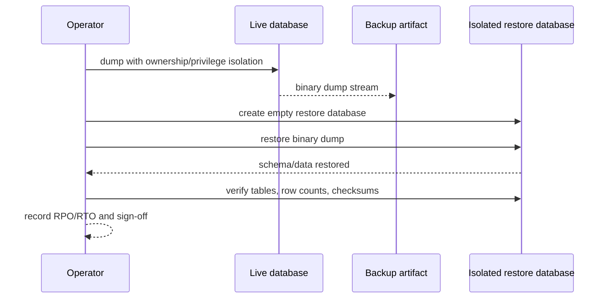
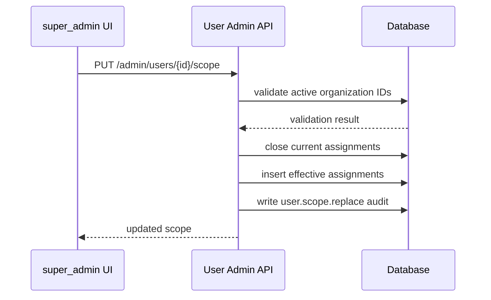
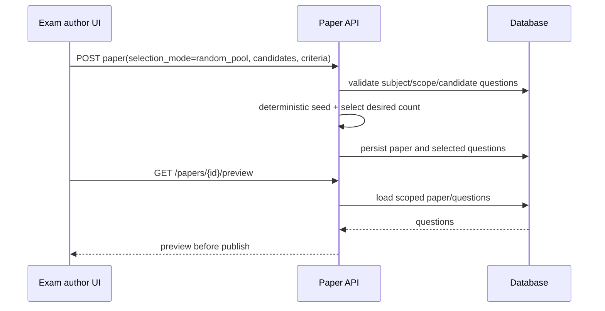
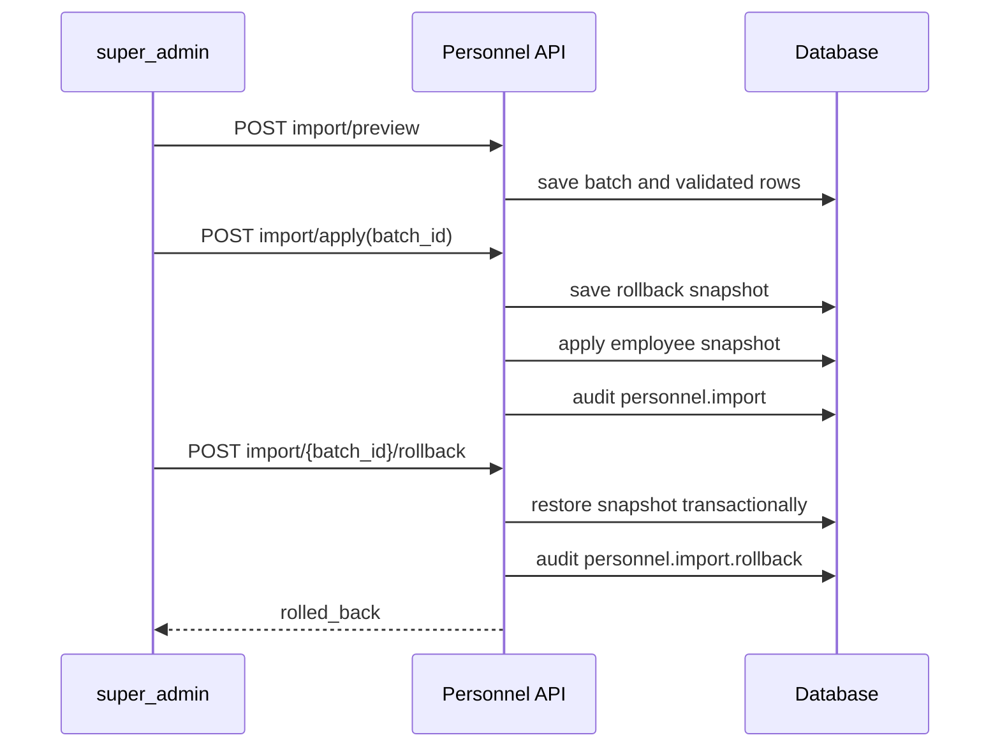
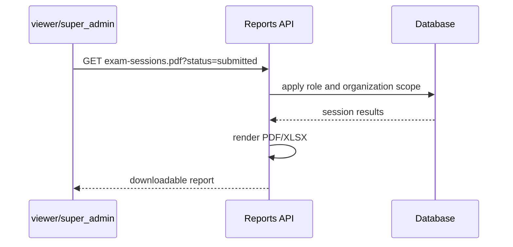

# Remaining Work Sequence Diagrams

## Authenticated load workflow

## Restore drill

## Permission and organization scope update

## Random-pool paper and preview

## Personnel import rollback

## Detailed report export

