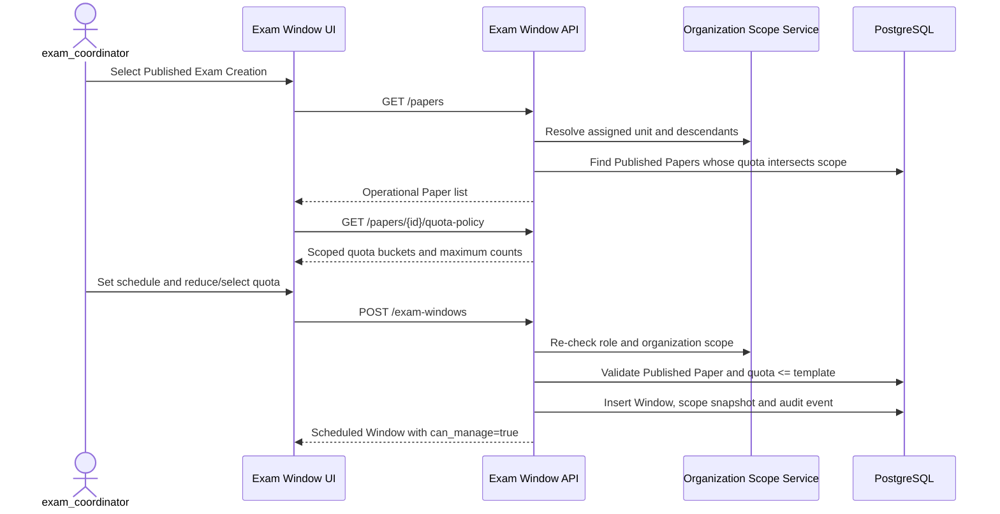

# Exam Coordinator Authorization Design

**Status:** Implemented MVP  
**Decision:** D-026  
**Use case:** UC-EXAM-00

## Purpose

Separate assessment content ownership from exam operations. `exam_author` owns questions and Exam
Creation policy; `exam_coordinator` schedules and operates Exam Windows within an explicitly assigned
organization scope. Backend authorization remains authoritative.

## Authorization matrix

| Capability | exam_author | exam_coordinator | super_admin |
|---|---:|---:|---:|
| Create/edit/publish/revise Exam Creation | Own creations | No | Emergency override where endpoint permits |
| Read an operational Paper template | Own/assigned content | Published templates intersecting coordinator scope | All |
| Create a new Exam Window | No | Yes, in assigned scope | Yes |
| Operate a newly-created Window | No | Creator only | All |
| Finish a legacy author-owned Window | Creator only | No | All |
| View scoped operational reporting | Own paper scope | Assigned unit and active descendants | All |

The legacy exception prevents existing author-owned open/suspended Windows from becoming orphaned.
Authors cannot create another Window, so the exception naturally disappears as historical Windows
reach a terminal state.

## Organization and quota invariants

1. Coordinator scope is the active assigned unit plus active descendants.
2. A coordinator sees only Published Exam Creations with at least one quota bucket in that scope.
3. The Window may select only exact quota buckets returned by the scoped Paper policy.
4. A Window quota may be reduced but never exceed the corresponding Exam Creation template count.
5. A coordinator cannot operate a Window created by another coordinator, even in the same unit.
6. `super_admin` is the audited emergency override.

No database migration is required: account roles are stored as portable strings and organization
assignments already model scope consistently on PostgreSQL, MySQL and SQLite.

## Create Window sequence



## Operate or deny sequence

```mermaid
sequenceDiagram
    actor O as operator
    participant UI as Exam Window UI
    participant API as Exam Window API
    participant DB as PostgreSQL

    O->>API: GET /exam-windows
    API->>DB: Read visible Windows and creator identities
    API-->>UI: Windows with per-row can_manage capability
    alt creator coordinator or legacy creator author
        O->>API: PATCH /exam-windows/{id}/status
        API->>DB: Validate lifecycle, write status and audit
        API-->>O: Updated Window
    else different creator or role
        UI: Hide mutation actions
        O->>API: Direct mutation attempt
        API-->>O: 403
    end
```

## Acceptance evidence

- API tests cover author create denial, coordinator create success, cross-organization denial,
  cross-coordinator mutation denial, scoped policy visibility and quota escalation denial.
- Vue tests cover the role capability matrix; the Window response controls row-level actions.
- PostgreSQL remains the primary integration target; portability avoids database-specific role SQL.
