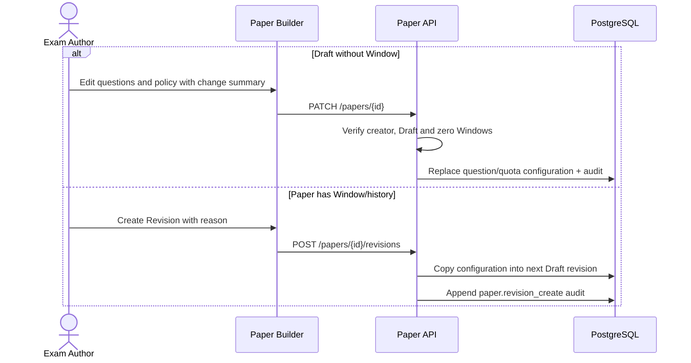

# ExamPaper Draft Editing and Revision Design

**Updated:** 2026-07-17

## Rules

- Direct editing is allowed only when the Paper is `draft` and no ExamWindow references it.
- Editing can replace title, subject, owner organization, questions, selection mode, variants,
  duration, pass percentage and quota template in one transaction.
- Every edit requires `change_summary`, updates actor/time metadata and appends `paper.edit` audit.
- A Paper that has been used is never rewritten. `POST /papers/{id}/revisions` copies its questions,
  quota template and policy into a new Draft with the same `family_id`, the next revision number and
  `based_on_paper_id`.
- An ExamWindow can be physically deleted only when it is Scheduled or Cancelled and has zero
  sessions. The deletion is authorized and audited. Closed/used Windows remain immutable evidence.

## Sequence

## Audit findings

| Finding | Resolution |
|---|---|
| Draft was described as editable but had no API/UI | Added scoped edit detail and transactional PATCH |
| Used Paper required manual recreation | Added traceable clone/revision family |
| Mistaken unused Window permanently blocked Draft recovery | Added guarded deletion for zero-session Scheduled/Cancelled Window |
| Changes lacked author-entered explanation | Required change summary/revision reason |

Physical Paper deletion remains out of scope. Archive is retained for any Paper with operational
history, and production approval remains separate from automated acceptance.
