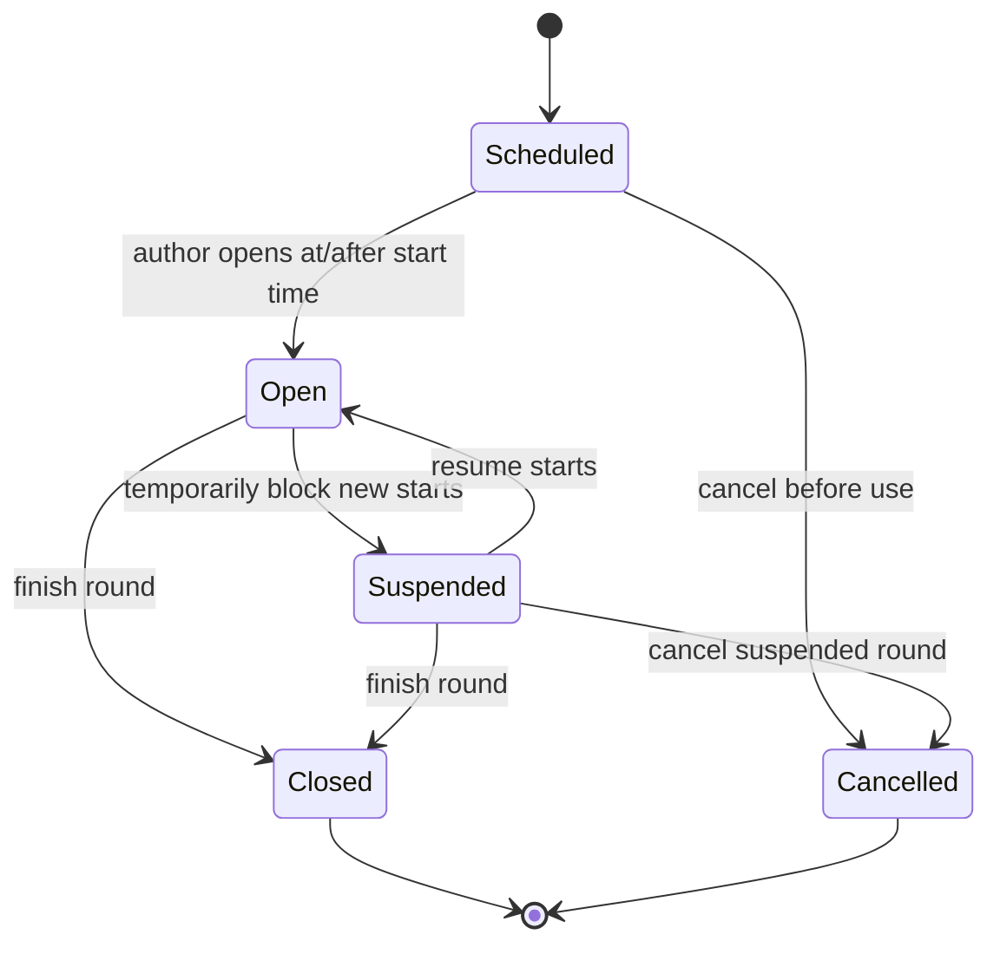
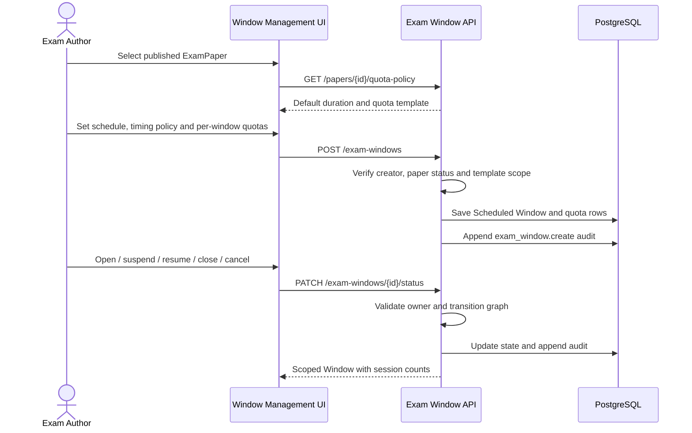

# ExamPaper and ExamWindow Lifecycle Design

**Updated:** 2026-07-17

## Domain boundary

| Aggregate | Owns | Does not own |
|---|---|---|
| ExamPaper | questions, variants, pass percentage, default duration, reusable organization/quota template, revision-safe lifecycle | actual examination dates or live participants |
| ExamWindow | one scheduled use of a published paper, actual duration, completion policy, organization quotas and operational lifecycle | question content or historical answer mutation |
| ExamSession | one person's immutable start/deadline, organization snapshot, answers and result | paper/window configuration |

Paper quota remains a reusable template for compatibility and authoring readiness. Creating a Window
copies selected template buckets and counts into `exam_window_scopes.eligible_count`; quota locking
and session counting then use the Window row. Changing one Window cannot alter another Window.

## Timing policies

- `fixed_end`: `ends_at = min(started_at + duration, window_close_at)`; all candidates stop no later
  than the Window close time.
- `full_duration`: `ends_at = started_at + duration`; `window_close_at` is the last time a new
  session may start, while existing sessions retain their complete duration.
- Server time remains authoritative. A Window must be Open and the start request must fall between
  its configured open and close boundaries.

## Window lifecycle

Closed and Cancelled are terminal. Suspending or closing blocks only new sessions; an existing
session retains its stored `ends_at`. All effective transitions enforce creator/super-admin
authorization at the API and append an audit event with previous state, next state and reason.
Suspended and Cancelled transitions require a non-empty reason at both the UI and API boundary.

## Create and operate sequence

## Compatibility and follow-up

- `allowed_org_unit_ids` and `POST /exam-windows/{id}/open` remain as compatibility contracts.
- Existing Window scopes are backfilled from their Paper quota template in migration `0014`.
- ExamPaper revision/clone and physical deletion of unused Draft papers remain separate follow-up
  work; papers referenced by a Window continue to be immutable through the existing Draft guard.

## Implementation audit — 2026-07-17

| Finding | Risk | Resolution |
|---|---|---|
| Open endpoint did not verify Window ownership | Cross-author mutation | Creator/super-admin check shared by compatibility and status endpoints |
| Capacity lock used the reusable Paper quota | Different rounds could not own independent capacity | Lock and count against `ExamWindowScope.eligible_count` |
| Session deadline always behaved as fixed-end | Operational rule was implicit | Typed fixed-end/full-duration policy and unit tests |
| Suspend/cancel reason was optional | Weak incident audit trail | Non-empty reason enforced at API and modal |

No Critical or High implementation finding remains in this slice. Revision/clone, unused-Draft
deletion and full production permission/device acceptance stay explicitly open rather than being
silently expanded into this change.
