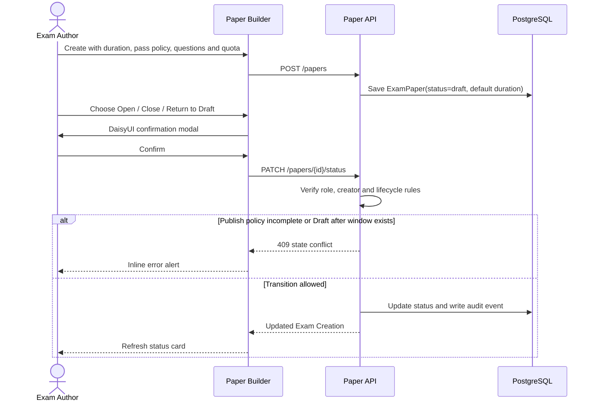
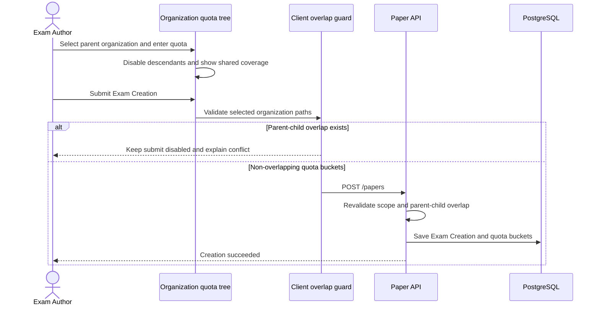

# Paper Builder Organization Quota UX

**Updated:** 2026-07-17
**Scope:** `/papers` Exam Creation policy, lifecycle and organization quota selection

## Purpose

The organization selector must communicate the hierarchy and prevent an Exam Creation from
assigning quota buckets to both an ancestor and its descendant. A quota on a parent is one shared
capacity bucket for that parent and every descendant; it is not copied to each child.

## Interaction contract

| Current state | User action | UI result |
|---|---|---|
| No unit selected in a branch | Select parent | Parent quota input appears; all descendants are disabled and labelled as covered by the parent |
| Parent selected | Inspect child | Child remains visible with `covered by <parent>` explanation |
| Child selected | Inspect ancestor | Ancestor is disabled and explains that a child quota already exists |
| One child selected | Select sibling | Allowed; each sibling has an independent quota bucket |
| Selected unit | Clear checkbox | Unit is removed and blocked ancestors/descendants become selectable again |

The UI includes a sticky summary listing selected quota buckets, counts, and the number of covered
descendants. Parent and child selections must never be auto-selected together because that would
misrepresent a shared parent quota as separate child quotas.

## Responsive behavior

- Smartphone/tablet: the tree and quota summary stack vertically; organization names wrap and the
  tree remains vertically scrollable.
- Notebook/desktop: the tree uses the available width and the summary is a sticky right column.
- Expand/collapse controls expose `aria-expanded`; disabled choices retain a visible reason.
- Organization choices are sorted alphabetically by display name. Hierarchical controls preserve
  parent-child grouping and sort sibling units by name.

## Validation and defense in depth

- The client disables conflicting checkboxes and applies a defensive overlap guard before submit.
- The backend remains authoritative and returns `422` for any parent-child overlap submitted outside
  the UI.
- Exam authors may create Exam Creations and quota buckets for their assigned organization and its
  active descendants. This lets a parent-unit author allocate quota to child units while preserving
  the overlap guard.
- Quota inputs remain non-negative integers and the create action remains unavailable for invalid
  policy data.

## Duration and lifecycle contract

- Every new Exam Creation stores `default_duration_minutes` (1–600, default 60). A newly created
  Exam Window inherits this value unless its request explicitly overrides `duration_minutes`.
- The page lists creations visible to the author, including status, duration, pass percentage,
  question count and quota-bucket count.
- Lifecycle labels are `ร่าง` (`draft`), `เปิดใช้งาน` (`published`) and `ปิดใช้งาน` (`archived`).
  All changes use a DaisyUI confirmation modal and `PATCH /papers/{paper_id}/status`.
- Publishing revalidates duration, pass policy, quota and questions. Archiving prevents new windows
  without interrupting existing windows or sessions. Returning to Draft is rejected after the first
  Exam Window exists so historical exam configuration cannot be rewritten.
- The backend permits lifecycle changes only to the creator and writes an audit event for every
  effective transition; UI visibility is not treated as authorization.

## Lifecycle sequence

## Selection sequence

## Automated evidence

- `frontend/src/components/papers/OrgQuotaTree.test.ts` covers parent coverage, ancestor blocking,
  sibling selection, quota updates, and defensive overlap detection.
- `tests/api/test_system_api.py` creates an Exam Creation through `POST /papers` with subject,
  question pool criteria, duration, passing policy, and organization quota; it covers lifecycle,
  inherited Exam Window duration, Draft conflict, permission denial and audit evidence.
- `frontend/src/components/papers/PaperLifecycleActions.test.ts` covers actions exposed for Draft,
  Published and Archived states without browser-native dialogs.
- Backend overlap and transaction-safe quota enforcement remain implemented in the paper and exam
  quota services.
