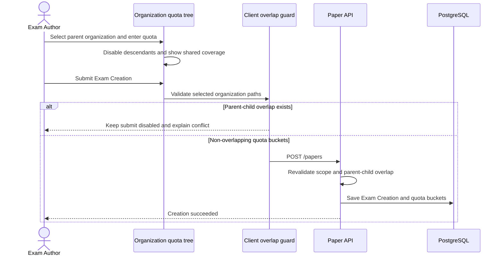

# Paper Builder Organization Quota UX

**Updated:** 2026-07-16
**Scope:** `/papers` Exam Creation organization quota selection

## Purpose

The organization selector must communicate the hierarchy and prevent an Exam Creation from
assigning quota buckets to both an ancestor and its descendant. A quota on a parent is one shared
capacity bucket for that parent and every descendant; it is not copied to each child.

## Interaction contract

| Current state | User action | UI result |
|---|---|---|
| No unit selected in a branch | Select parent | Parent quota input appears; all descendants are disabled and labelled as covered by the parent |
| Parent selected | Inspect child | Child remains visible with `covered by <parent>` explanation |
| Child selected | Inspect ancestor | Ancestor is disabled and explains that a child quota already exists |
| One child selected | Select sibling | Allowed; each sibling has an independent quota bucket |
| Selected unit | Clear checkbox | Unit is removed and blocked ancestors/descendants become selectable again |

The UI includes a sticky summary listing selected quota buckets, counts, and the number of covered
descendants. Parent and child selections must never be auto-selected together because that would
misrepresent a shared parent quota as separate child quotas.

## Responsive behavior

- Smartphone/tablet: the tree and quota summary stack vertically; organization names wrap and the
  tree remains vertically scrollable.
- Notebook/desktop: the tree uses the available width and the summary is a sticky right column.
- Expand/collapse controls expose `aria-expanded`; disabled choices retain a visible reason.

## Validation and defense in depth

- The client disables conflicting checkboxes and applies a defensive overlap guard before submit.
- The backend remains authoritative and returns `422` for any parent-child overlap submitted outside
  the UI.
- Quota inputs remain non-negative integers and the create action remains unavailable for invalid
  policy data.

## Selection sequence

## Automated evidence

- `frontend/src/components/papers/OrgQuotaTree.test.ts` covers parent coverage, ancestor blocking,
  sibling selection, quota updates, and defensive overlap detection.
- Backend overlap and transaction-safe quota enforcement remain implemented in the paper and exam
  quota services.
