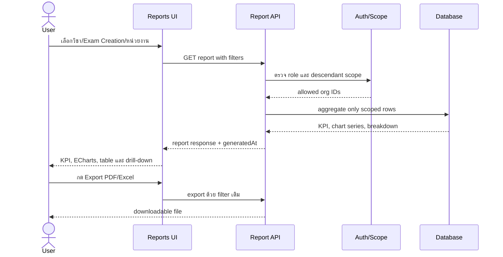

# Reporting UI/UX and Implementation Plan

**Version:** 1.1
**Updated:** 2026-07-16  
**Status:** Implemented — automated verification; device/human acceptance pending

เอกสารนี้กำหนด layout, UX, สิทธิ์ และแผนพัฒนารายงานของ MTExam โดยรายงานทุกชนิดต้องผูกกับ `Exam Creation` และบังคับ scope ที่ API เสมอ

## 1. เป้าหมาย

- ให้ผู้บริหารเห็นภาพรวมและเจาะลงถึงหน่วยลูกได้ในหน้าเดียว
- ให้ผู้ดูแลหน่วยติดตามการเข้าสอบและผู้ที่ต้องติดตามได้ทันที
- ให้ผู้สร้างข้อสอบวิเคราะห์คุณภาพข้อสอบและแต่ละชุดข้อสอบ
- ให้ผู้สอบดูผลของตนเองพร้อมเฉลยและเหตุผลตามนโยบายรอบสอบ
- รองรับ smartphone, tablet, notebook และ PC โดยไม่ใช้ browser alert

## 2. Information architecture

หน้า `/reports` แบ่งเป็น 5 ส่วนตามลำดับการตัดสินใจ:

1. **Report context bar** — เลือกวิชา, Exam Creation, Exam Window, ช่วงเวลา และหน่วยงาน (แสดงเฉพาะค่าที่อยู่ใน scope)
2. **KPI cards** — ผู้มีสิทธิ์สอบ, เข้าสอบ, ส่งแล้ว, ผ่าน, ไม่ผ่าน, อัตราผ่าน, คะแนนเฉลี่ย
3. **Charts** — กราฟสถานะการเข้าสอบ, ผ่าน/ไม่ผ่าน และคะแนนเฉลี่ยรายหน่วย
4. **Breakdown table** — ตารางหน่วยงานเรียงจากภาพรวมลงหน่วยลูก พร้อมปุ่มดูรายละเอียด
5. **Action bar** — PDF, Excel, CSV, พิมพ์ และรีเซ็ตตัวกรอง พร้อมแสดงเวลาอัปเดตข้อมูล

บนมือถือให้เรียงเป็น KPI → กราฟ → ตารางแบบ card/list และย้ายตัวกรองเข้า hamburger/drawer; บนจอใหญ่ใช้ 12-column grid และตารางเต็มความกว้าง

## 3. Layout ตาม role

| Role | หน้าแรกของรายงาน | รายงานบังคับ | Scope |
|---|---|---|---|
| `super_admin` | System Overview | ภาพรวม, เปรียบเทียบทุกหน่วย, Exam Creation, รายบุคคล, คุณภาพข้อสอบ, Audit/export | ทุกหน่วย |
| `division_admin` | Division Overview | ภาพรวม บช., เปรียบเทียบ บก., ผ่าน/ไม่ผ่าน, ไม่เข้าสอบ, รายบุคคล, export | หน่วยตนเอง + หน่วยลูก |
| `bureau_admin` | Bureau Overview | ภาพรวม บก., เปรียบเทียบ กก., ผ่าน/ไม่ผ่าน, ไม่เข้าสอบ, รายบุคคล, export | หน่วยตนเอง + หน่วยลูก |
| `station_admin` | Station Overview | บุคลากรที่ต้องสอบ, เข้าสอบ, ผ่าน/ไม่ผ่าน, ไม่ส่ง, รายบุคคล, export | หน่วยตนเอง + หน่วยลูก |
| `exam_author` | Exam Creation Analytics | จำนวนข้อ, สถานะข้อ, สถิติชุดสอบ, วิเคราะห์รายข้อ/ตัวเลือก/variants | ชุดที่สร้างหรือได้รับมอบหมาย |
| `exam_coordinator` | Exam Operations Dashboard | attendance, session status, quota usage และผลรอบสอบ | หน่วยงานที่ได้รับมอบหมายและหน่วยงานลูก |
| `viewer` | Scoped Overview | รายงานอ่านอย่างเดียวตาม scope และ export ที่ได้รับอนุญาต | scope ที่กำหนด |
| `examinee` | My Results | ประวัติสอบ, คะแนน, ผ่าน/ไม่ผ่าน, เฉลย/เหตุผล, เวลาที่ใช้ | ของตนเองเท่านั้น |

## 4. UX rules

- ทุกตารางมี loading skeleton, empty state, error state และ retry
- ใช้ DaisyUI `card`, `stat`, `tabs`, `select`, `drawer`, `table`, `badge`, `progress` และ `modal` เท่านั้นสำหรับ feedback/confirmation
- ห้ามใช้ browser `alert` หรือ `confirm`
- การกดดูรายละเอียดใช้ drawer บนมือถือและ modal/drawer ด้านขวาบน desktop
- สถานะใช้สีร่วมกับข้อความและ icon เสมอ เพื่อรองรับผู้มีปัญหาการมองเห็นสี
- กราฟต้องมีตารางข้อมูลหรือ tooltip เป็นทางเลือก และมีข้อความสรุปสำหรับ screen reader
- ค่าเริ่มต้นเลือก Exam Creation ล่าสุดที่ผู้ใช้มีสิทธิ์เห็น และไม่โหลดข้อมูลนอก scope
- export ต้องสะท้อนตัวกรองปัจจุบันและเขียนชื่อไฟล์ที่มีวิชา/Exam Creation/วันที่

## 5. แผน Implement แบบ Kanban

| ลำดับ | Ticket | ผลส่งมอบ | เกณฑ์รับงาน |
|---:|---|---|---|
| 1 | REPORT-UX-01 | report contract, filter model และ permission matrix | role ทุกตัวมี endpoint/scope ที่ระบุและมี 403 test |
| 2 | REPORT-API-02 | summary/organization/exam-creation aggregation | ผลรวมตรงกับ fixture และไม่รั่วข้ามหน่วย |
| 3 | REPORT-API-03 | pass/fail, attendance, time และ question analytics | มีสูตร/เกณฑ์ผ่านต่อ Exam Creation และ test ครบ |
| 4 | REPORT-UI-04 | responsive context bar + KPI cards | ผ่าน smartphone/tablet/notebook/PC acceptance |
| 5 | REPORT-UI-05 | ECharts status/pass-fail/unit charts | มี empty/error/loading/accessibility fallback |
| 6 | REPORT-UI-06 | drill-down table และ examinee result drawer | scope, pagination และ navigation ทำงานจริง |
| 7 | REPORT-EXP-07 | PDF ก่อน, Excel/CSV ต่อมา | export ใช้ filter เดียวกับหน้าและตรวจไฟล์ได้ |
| 8 | REPORT-QA-08 | API/UI/permission/load tests และ sequence evidence | pytest, type-check, build และ 500-user threshold ผ่าน |

## 6. Sequence หลัก

## 7. Definition of Done

- มี API contract และ sequence diagram สำหรับทุกรายงาน
- ตรวจสิทธิ์ที่ backend และมี negative tests ข้ามหน่วยงาน
- คะแนนผ่าน/ไม่ผ่านใช้เกณฑ์ที่บันทึกใน Exam Creation เดียวกัน
- UI responsive และใช้ DaisyUI โดยไม่มี browser alert
- PDF ภาษาไทยอ่านได้ และ Excel/CSV เปิดได้จริง
- มี audit event สำหรับการ export และการดูข้อมูลรายบุคคล
- เอกสาร, Kanban ticket, automated tests และ acceptance evidence เชื่อมโยงกัน

## 8. Implemented API contract

- `GET /reports/context` คืนตัวเลือกที่ผ่าน role และ organization scope เท่านั้น
- `GET /reports/dashboard` ใช้ filter `subject_id`, `exam_paper_id`, `exam_window_id`,
  `date_from`, `date_to`, `org_unit_id`, `page` และ `page_size`
- `GET /reports/people/{session_id}`, `/reports/my-results` และ
  `/reports/question-analytics` แยกตาม admin/author/examinee scope
- `GET /reports/export?format=pdf|xlsx|csv` เรียก aggregation และ filter model เดียวกับ dashboard
- Exam Creation บันทึก `passing_percentage` และ quota ต่อหน่วย; session บันทึกทั้งหน่วยจริง
  และ quota unit snapshot โดย backend lock quota ก่อนเริ่มสอบ
- การเลือกเก็บ quota เป็นจำนวนทำให้ `not_started` มีเฉพาะยอดรวม ไม่สามารถระบุรายชื่อผู้ไม่เข้าสอบ

### Full-width application shell

- Authenticated pages and the primary navigation use the available viewport width without a fixed
  `max-width`, allowing report charts and data tables to expand on notebook and desktop displays.
- Responsive horizontal gutters remain at 16 px on smartphones, 24 px on tablets, 32 px on desktop,
  and 40 px on extra-wide screens so content does not touch the viewport edge.

Automated evidence อยู่ที่ `tests/api/test_reporting_api.py`,
`tests/unit/test_report_rules.py` และ frontend component tests ใต้ `frontend/src`.
Local browser acceptance ผ่านที่ 360, 768, 1366 และ 1920 px โดยไม่มี horizontal overflow,
mobile drawer และ desktop sidebar ทำงานจริง, ECharts มี canvas สูง 288 px และไม่มี console error.
