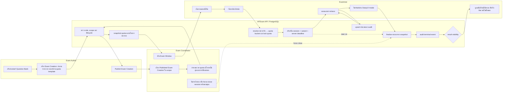
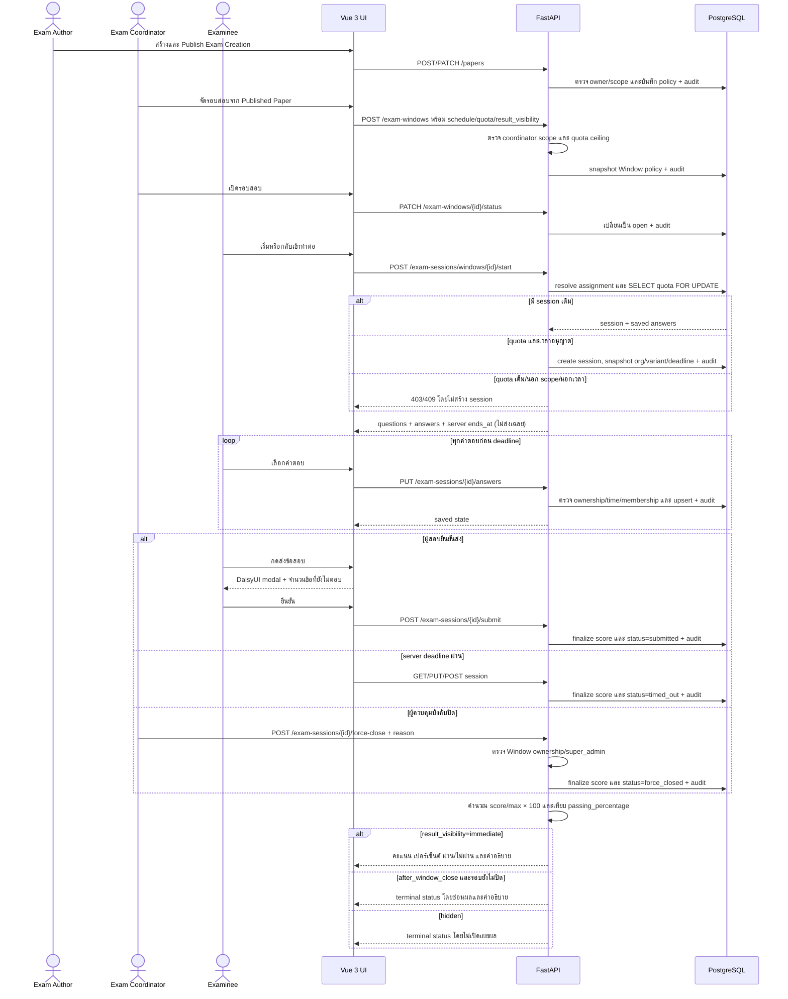

# End-to-End Exam Workflow

**Updated:** 2026-07-17
**Status:** Implemented baseline / production human acceptance pending
**Ticket:** EXAM-E2E-005

เอกสารนี้เป็น behavioral overview ตั้งแต่สร้างเนื้อหาจนผู้สอบส่งหรือหมดเวลา โดย backend
เป็นผู้ตัดสิน authorization, organization scope, quota, เวลา คะแนน และการเปิดเผยผลเสมอ

## Swimlane

## Sequence — schedule, take, finalize and reveal

## Invariants and operational notes

- การส่งซ้ำคืนผลเดิมและไม่คำนวณ attempt ใหม่
- Unanswered questions ได้ศูนย์ แต่ modal ต้องแจ้งจำนวนก่อนยืนยัน
- `submitted`, `timed_out` และ `force_closed` ใช้ scoring service เดียวกัน
- ผลที่ซ่อนต้องไม่ส่ง score, percentage, pass state หรือ rationale ไปยัง examinee API
- Automatic timeout เป็น request-driven baseline: request ถัดไปที่แตะ session จะ finalize ทันที
  งาน scheduler สำหรับ proactive finalization เป็น operational enhancement ไม่ใช่เงื่อนไขความถูกต้อง
- Window close หยุดการเริ่มใหม่; session แบบ `full_duration` ยังคงใช้ deadline ที่ snapshot ไว้

## Automated evidence

- `tests/api/test_exam_session_lifecycle.py`
- `tests/api/test_system_api.py`
- `tests/integration/test_reporting_postgres.py`
- `frontend/src/components/exam/ExamSubmitPanel.test.ts`

Production Done ยังต้องมี human acceptance บน 360, 768, 1366 และ 1920 px รวมถึง
authenticated workflow load test และ external security sign-off
