# Use-Case Sequence Diagrams

Diagrams below describe the API-first flow. Vue is a client of the API; it is never the authority for identity, authorization, score, or durable exam state.

## UC-AUTH-01 — Login

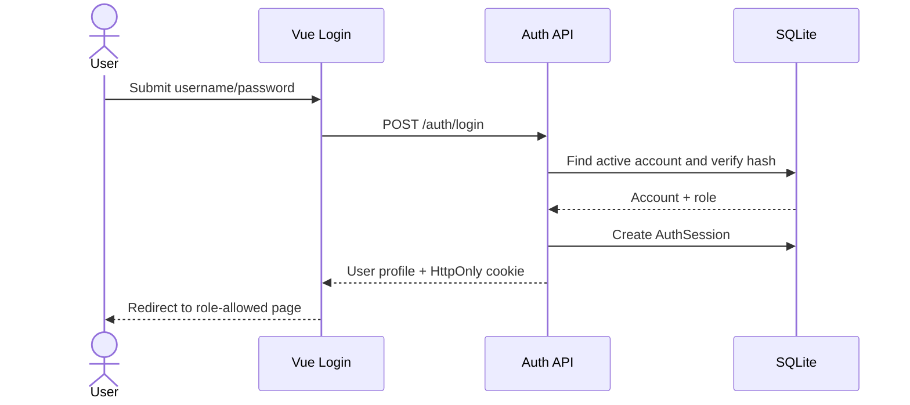

## UC-AUTH-02 — Logout

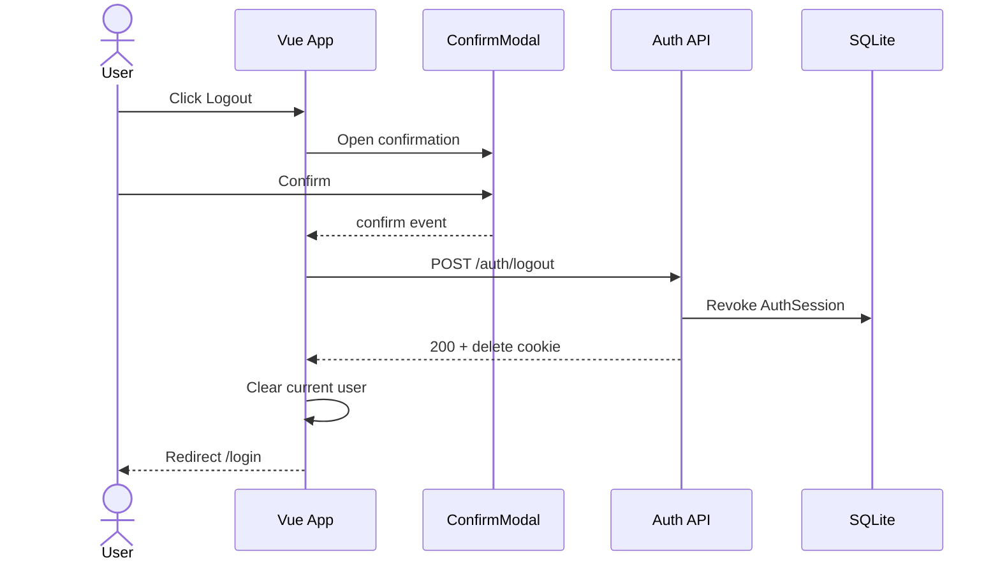

## UC-ORG-01 — Import personnel CSV snapshot

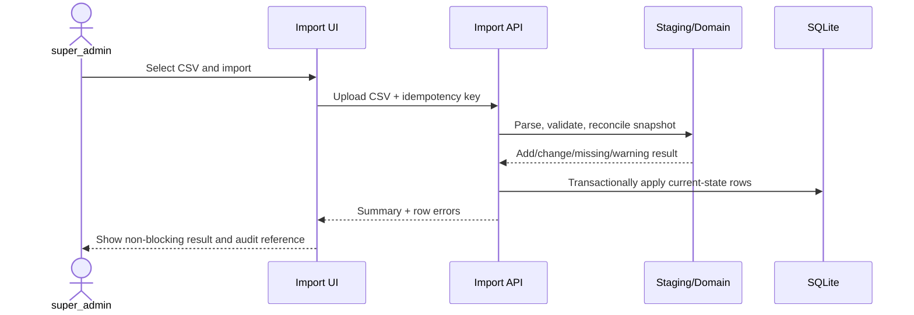

## UC-ORG-02 — Review and apply staged personnel import

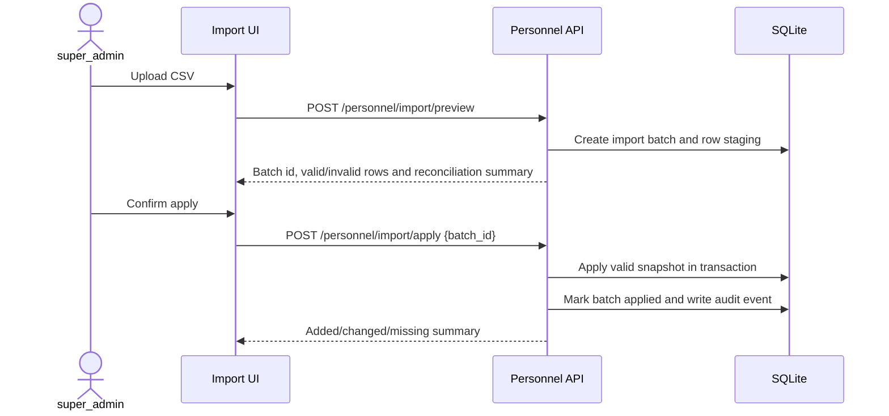

## UC-ADMIN-01 — Manage system settings

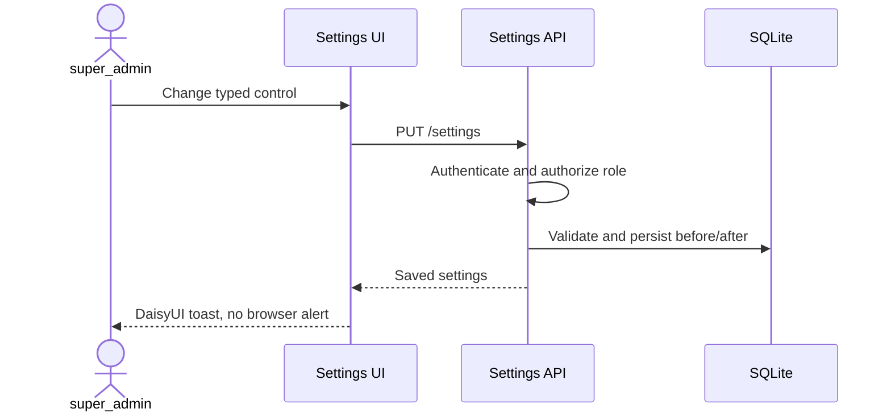

## UC-ADMIN-02 — Manage user accounts and roles

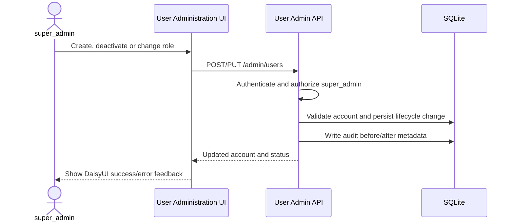

## UC-AUDIT-01 — Review audit events

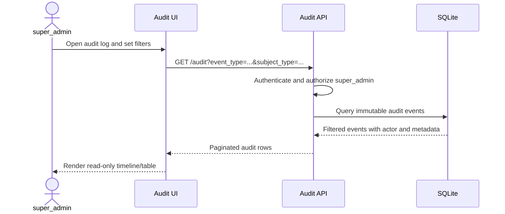

## UC-QBANK-01 — Author question bank

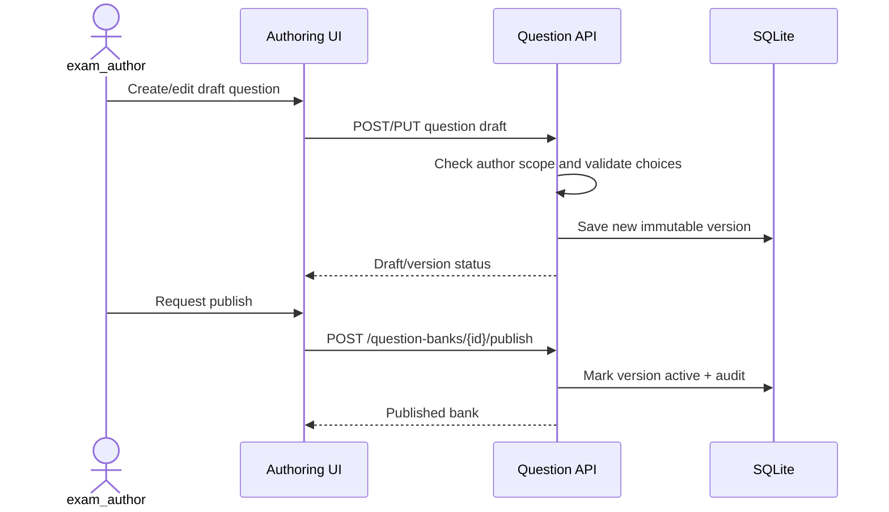

## UC-QBANK-02 — Manage questions inside a bank

```mermaid
sequenceDiagram
    actor E as exam_author
    participant UI as Question Bank UI
    participant API as Question API
    participant DB as SQLite
    E->>UI: Select subject and draft bank
    UI->>API: GET /question-banks/{bank_id}/questions
    API->>DB: Load questions and choices
    DB-->>API: Question list
    API-->>UI: Render question cards
    E->>UI: Enter question, choices and one correct answer
    UI->>API: POST /question-banks/{bank_id}/questions
    API->>API: Validate 2-10 choices and exactly one correct
    API->>DB: Save question, choices and audit event
    API-->>UI: Draft question id
    E->>UI: Publish bank
    UI->>API: POST /question-banks/{bank_id}/publish
    API->>DB: Verify questions and choices; set bank active
    API-->>UI: Published bank
```

## UC-PAPER-01 — Publish an Exam Creation

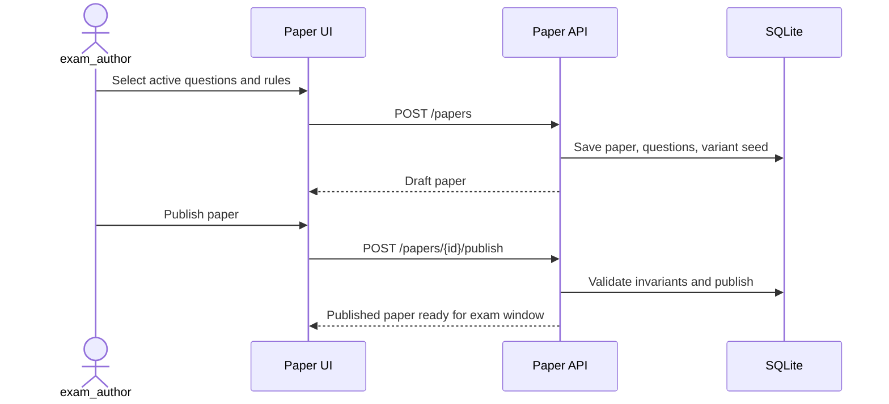

## UC-SUBJECT-01 — Select/create subject

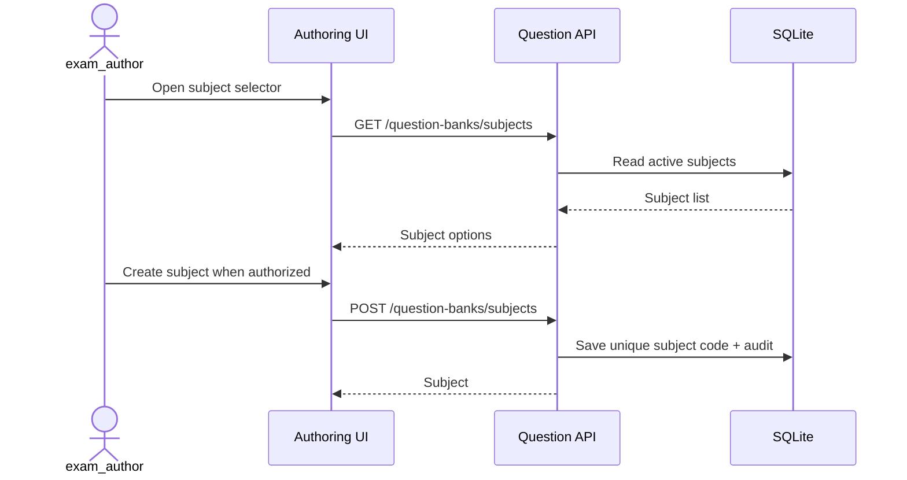

## UC-PAPER-02 — Create Exam Creation and sets

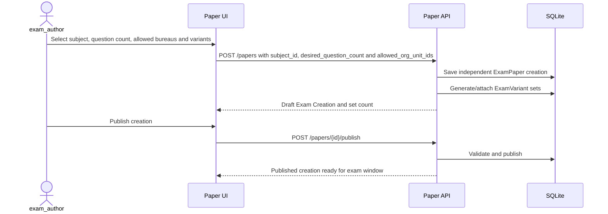

## UC-REPORT-02 — View statistics for one Exam Creation

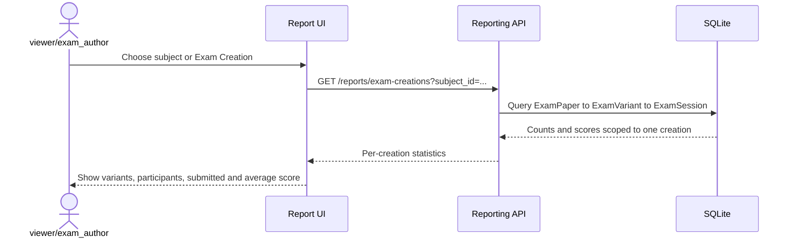

## UC-EXAM-01 — Start or resume exam

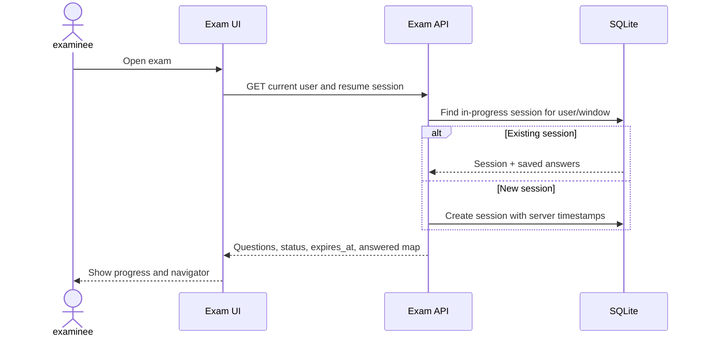

The production session endpoints are `POST /exam-sessions/windows/{window_id}/start` and
`GET /exam-sessions/{session_id}`. The API creates the immutable question-version snapshot and
returns the server `ends_at` deadline.

## UC-EXAM-02 — Answer and autosave/recover

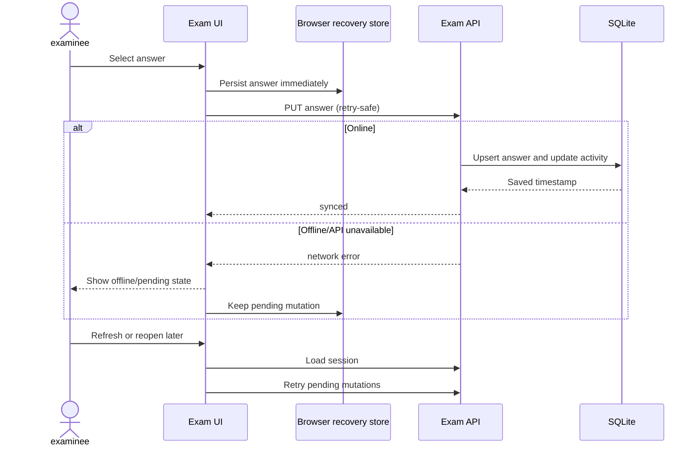

## UC-EXAM-03 — Submit exam and reveal result

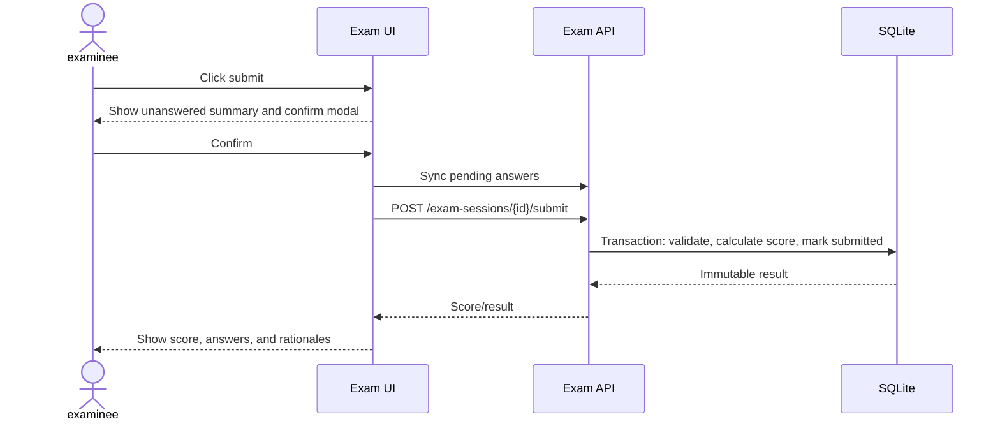

Submission is idempotent: repeating the submit request returns the stored result rather than
recalculating a different score.

## UC-REPORT-01 — View scoped report

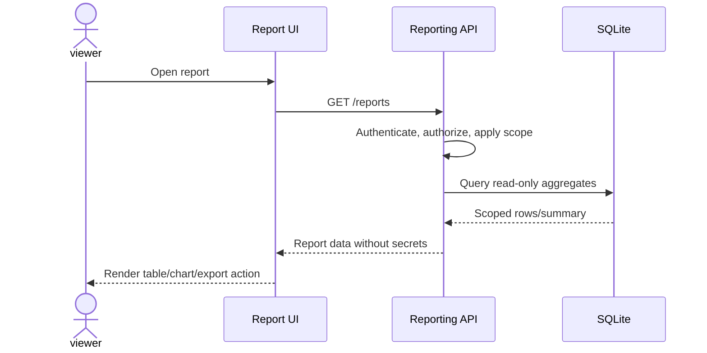

## UC-REPORT-03 — Filter, drill down and export

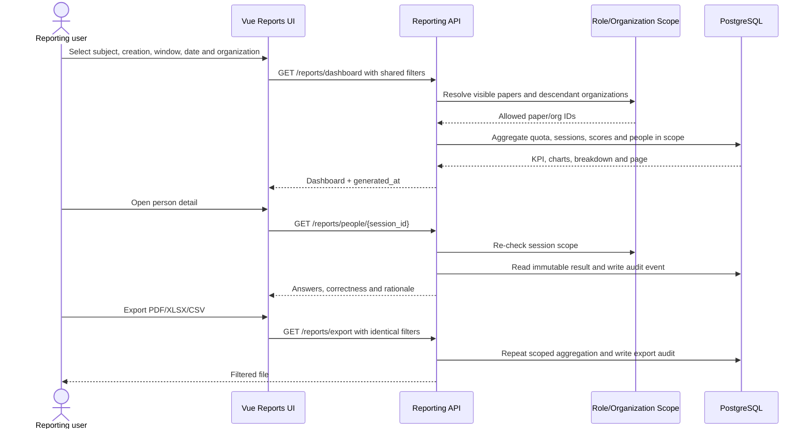

## UC-REPORT-04 — Reserve organization quota at exam start

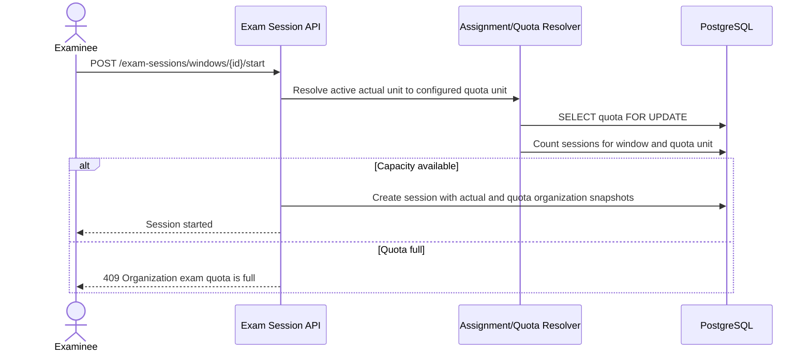
